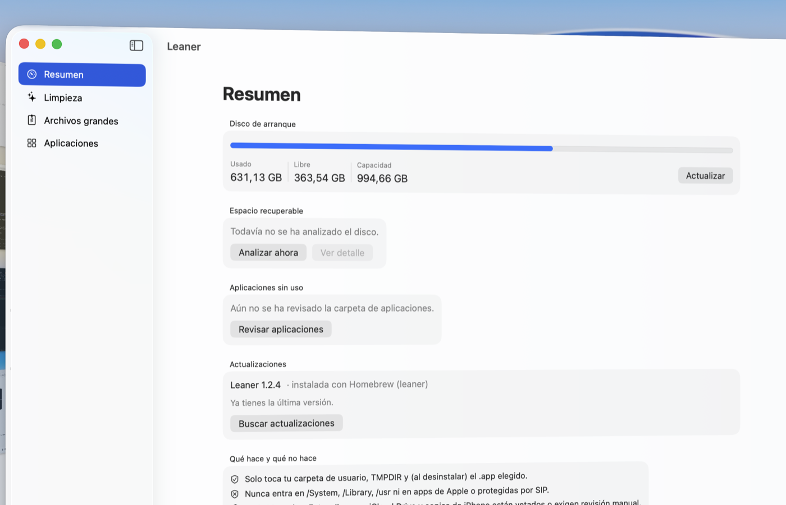
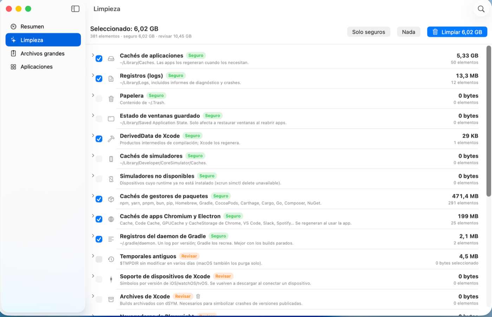

<p align="right"><b>English</b> · <a href="README.es.md">Español</a></p>

<h1 align="center">Leaner</h1>

<p align="center">
  <strong>Reclaim the disk space Xcode, Gradle, Maven, node and the simulators eat.</strong><br>
  A native app for macOS 14 or later. Signed with a Developer ID and notarized by Apple.
</p>

<p align="center">
  <a href="https://github.com/leaner-app/releases/releases/latest/download/Leaner.dmg"><b>Download .dmg</b></a> ·
  <a href="https://github.com/leaner-app/path-policy"><b>Audit what it deletes</b></a> ·
  <a href="https://leaner-app.github.io/releases/"><b>Website</b></a>
</p>

<p align="center">
  
  <br><br>
  
</p>

## Install

```bash
brew install --cask leaner-app/tap/leaner
```

Or download the [.dmg](https://github.com/leaner-app/releases/releases/latest/download/Leaner.dmg)
and drag Leaner into Applications. There is also a terminal installer:

```bash
curl -fsSL https://raw.githubusercontent.com/leaner-app/releases/main/install.sh | zsh
```

## Why it exists

Mac disk cleaners go after browser caches and language files. On a development machine that is
pocket change: the weight is in dependency repositories, downloaded distributions, build indexes
and simulators.

On the machine where Leaner is built, the first measurement looked like this:

| | |
|---|---|
| Chromium and Electron app caches (Chrome, VS Code, Slack, Spotify…) | 11.5 GB |
| Local Maven repository | 7.1 GB |
| Gradle distributions and JDKs | 5.2 GB |
| Command-line tool caches (`~/.cache`) | 2.2 GB |
| Package manager caches (npm, yarn, pnpm, pip, Homebrew, Cargo, Go…) | 1.2 GB |
| Gradle daemon logs | 1.2 GB |
| Everything else (system caches, Trash, downloads, data from uninstalled apps…) | ~1 GB |
| **Total proposed** | **29 GB** |

After that first cleanup the same machine still proposes around 16 GB: caches come back and
dependency repositories grow again. Leaner is meant to be run periodically, not once.

## What it cleans

| Category | Risk |
|---|---|
| App caches and logs, Trash, saved window state | Safe |
| Chromium and Electron app caches | Safe |
| npm, yarn, pnpm, bun, pip, Homebrew, Gradle, CocoaPods, Cargo, Go, Composer, NuGet caches | Safe |
| Xcode DerivedData, simulator caches and simulators with no runtime | Safe |
| Gradle daemon logs | Safe |
| Local Maven repository, Gradle distributions and JDKs | Review |
| Command-line tool caches and old temporary files | Review |
| Xcode device support and archives, Playwright browsers | Review |
| Apps installed in shut-down simulators (the device itself is kept) | Review |
| Mail downloads, installers and old downloads | Review |
| iPhone and iPad backups, data from uninstalled apps | Review |

Anything **Safe** is preselected; **Review** items are only removed if you check them yourself.
Leaner also uninstalls unused apps along with their leftover data, and finds your largest files.

## Why you can trust it

An app that deletes files and asks for Full Disk Access has to earn that trust:

- **The deletion policy is public and auditable**: [leaner-app/path-policy](https://github.com/leaner-app/path-policy).
  Clone it and run `swift test`. It is the same file the app is built from, published with its `sha256`.
- **Single authority**: that policy is consulted when scanning and **again right before every
  deletion**, so a bug in a scanner cannot turn into a bad delete.
- **Bounded scope**: only your home folder, `$TMPDIR` and, when uninstalling, the app you pick.
  Never `/System`, `/Library`, `/usr`, or Apple and SIP-protected apps.
- **Off-limits areas**: Mail, Messages, Photos, keychains, iCloud Drive, Apple containers and
  Photos or Music libraries are neither deleted nor traversed.
- **Reversible where it matters**: anything marked “Review”, and uninstalls, go to the Trash.
- **No telemetry.** The app only reaches the network to check for a new version.

## Permissions

To read the Trash, Mail downloads and iPhone backups, Leaner needs Full Disk Access in
System Settings → Privacy & Security. The app takes you to that screen with a button. Without
that permission it still works, it just skips those categories.

## Updates

The app tells you when a new version is out and installs it after checking that it is signed by
the same developer and accepted by Gatekeeper. If you installed it with Homebrew, it defers to
`brew upgrade` so brew's bookkeeping stays correct.

---

The interface is available in English and Spanish, following your system language.
Bugs and suggestions in [Issues](https://github.com/leaner-app/releases/issues).
